# **42 Piscine from July 2025.**

**198** hours logtime in total.

Finished at **Level 06** at **91%**.

## List of projects:
### Shell00
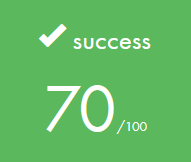     
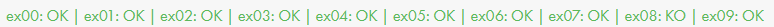

### Shell01
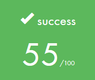
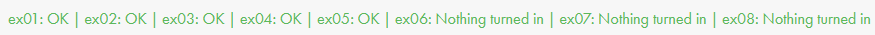

### C00

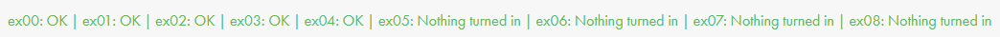

### C01
     
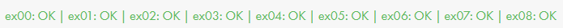

### C02

### C03
     
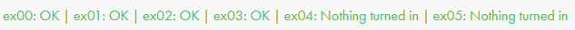

### C04
     

### C05
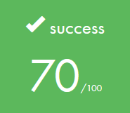     
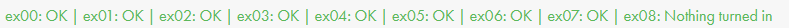

### C06
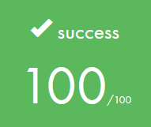     
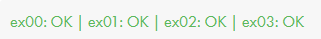

### C07
*Didn't have the time to finish all mandatory part, and learn all things about malloc.*     
     
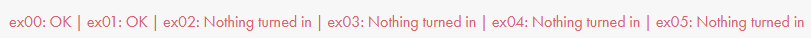

## Rushs:
### Rush00
*We did it well, even with bonus but one of our group didn't come so it's a 0. :(*     
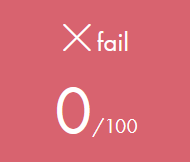

### Rush01
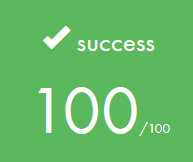

## Exams:
### Exam00
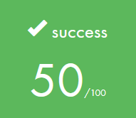

### Exam01
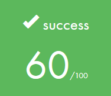

### Exam02
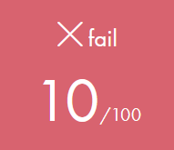

### Final Exam

