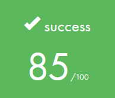
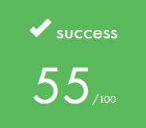
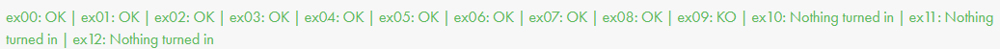
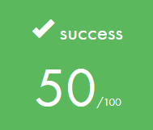
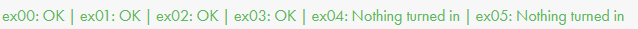
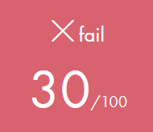
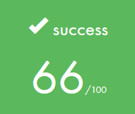

# **42 Piscine from July 2025.**

**198** hours logtime in total.

Finished at **Level 06** at **91%**.

## List of projects:
### Shell00
     

### Shell01

### C00

### C01
     

### C02

### C03
     

### C04
     

### C05
     

### C06
     

### C07
*Didn't have the time to finish all mandatory part, and learn all things about malloc.*     
     

## Rushs:
### Rush00
*We did it well, even with bonus but one of our group didn't come so it's a 0. :(*     

### Rush01

## Exams:
### Exam00

### Exam01

### Exam02

### Final Exam

